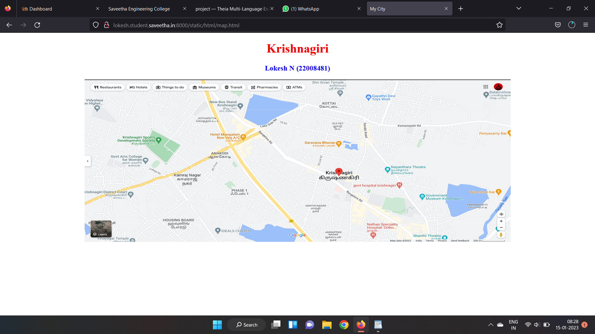
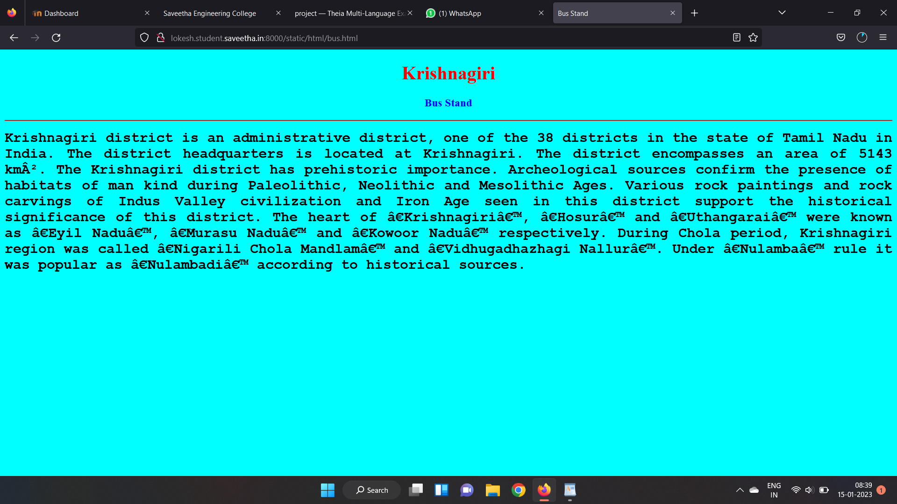
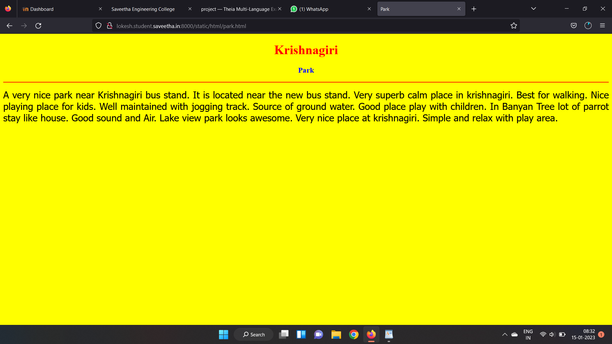
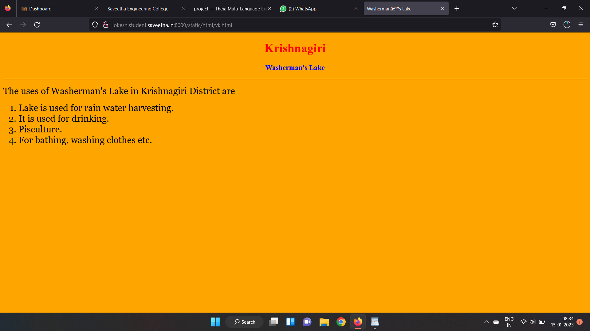
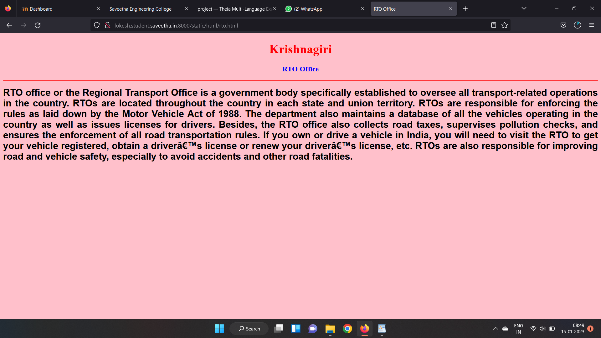
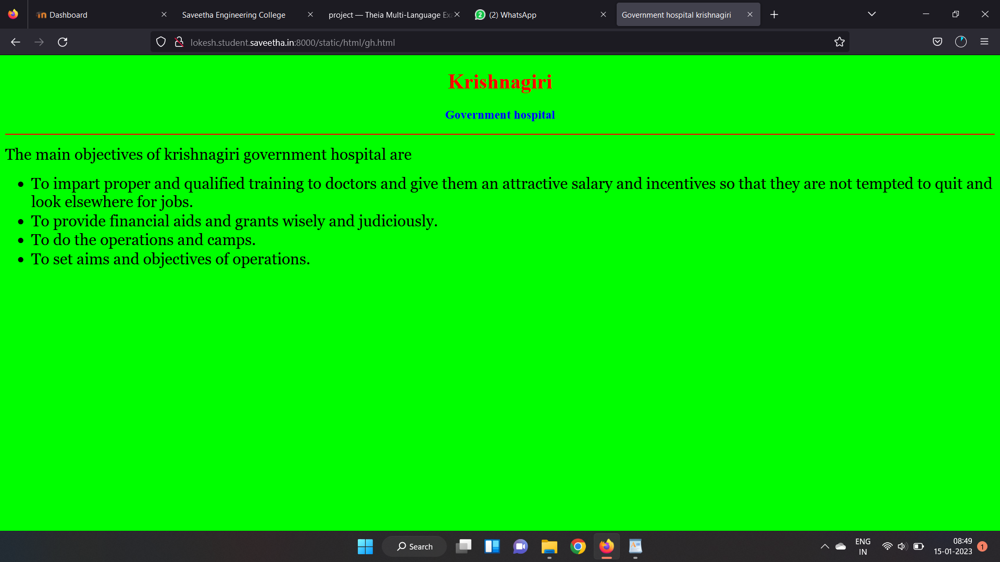

# Places Around Me
## AIM:
To develop a website to display details about the places around my house.

## Design Steps:

### Step 1:
clone the github repository into theia IDE.

### Step 2:
Create a new Django project

## Step 3:
Write the needed HTML code.

## Step 4:
Run the Django server and execute the HTML files.

## Code:
```
map.html
<!DOCTYPE html>
<html lang="en">
<head>
<title>My City</title>
</head>
<body>
<h1 align="center">
<font color="red"><b>Krishnagiri</b></font>
</h1>
<h3 align="center">
<font color="blue"><b>Lokesh N (22008481)</b></font>
</h3>
<center>

<map name="MyCity">
<area shape="circle" coords="190,50,20" href="/static/html/ghs.html" title="Government hospital">
<area shape="rectangle" coords="230,30,260,60" href="/static/html/rto.html" title="RTO Office">
<area shape="circle" coords="400,350,50" href="/static/html/vk.html" title="Washerman's Lake">
<area shape="circle" coords="400,200,75" href="/static/html/bus.html" title=" Bus Stand">
<area shape="rectangle" coords="490,150,870,320" href="/static/html/park.html" title="Park">
</map>
</center>
</body>
</html>

bus.html
<!DOCTYPE html>
<html lang="en">
<head>
<title>Bus Stand</title>
</head>
<body bgcolor="cyan">
<h1 align="center">
<font color="red"><b>Krishnagiri</b></font>
</h1>
<h3 align="center">
<font color="blue"><b>Bus Stand</b></font>
</h3>
<hr size="3" color="red">
<p align="justify">
<font face="Courier New" size="5">
<b>
Krishnagiri district is an administrative district, one of the 38 districts in the 
state of Tamil Nadu in India. The district headquarters is located at Krishnagiri. 
The district encompasses an area of 5143 km². The Krishnagiri district has prehistoric 
importance. Archeological sources confirm the presence of habitats of man kind during
Paleolithic, Neolithic and Mesolithic Ages. Various rock paintings and rock carvings
of Indus Valley civilization and Iron Age seen in this district support the historical
significance of this district. The heart of ‘Krishnagiri’, ‘Hosur’ and ‘Uthangarai’
were known as ‘Eyil Nadu’, ‘Murasu Nadu’ and ‘Kowoor Nadu’ respectively. During Chola
period, Krishnagiri region was called ‘Nigarili Chola Mandlam’ and ‘Vidhugadhazhagi
Nallur’. Under ‘Nulamba’ rule it was popular as ‘Nulambadi’ according to historical sources.
</b>
</font>
</p>
</body>
</html>

park.html
<!DOCTYPE html>
<html lang="en">
<head>
<title>Park</title>
</head>
<body bgcolor="yellow">
<h1 align="center">
<font color="red"><b>Krishnagiri</b></font>
</h1>
<h3 align="center">
<font color="blue"><b>Park</b></font>
</h3>
<hr size="3" color="red">
<p align="justify">
<font face="Tahoma" size="5">
A very nice park near Krishnagiri bus stand. It is located near the new bus stand. 
Very superb calm place in krishnagiri. Best for walking. Nice playing place for kids.
Well maintained with jogging track. Source of ground water.
Good place play with children.  In Banyan Tree lot of parrot stay like house. 
Good sound and Air. Lake view park looks awesome.
Very nice place at krishnagiri.
Simple and relax with play area.
</font>
</p>
</body>
</html>

rto.html
<!DOCTYPE html>
<html lang="en">
<head>
<title>RTO Office</title>
</head>
<body bgcolor="pink">
<h1 align="center">
<font color="red"><b>Krishnagiri</b></font>
</h1>
<h3 align="center">
<font color="blue"><b>RTO Office</b></font>
</h3>
<hr size="3" color="red">
<p align="justify">
<font face="Arial" size="5">
<b>
RTO office or the Regional Transport Office is a government body specifically established
to oversee all transport-related operations in the country. RTOs are located throughout the
country in each state and union territory. RTOs are responsible for enforcing the rules as laid
down by the Motor Vehicle Act of 1988.
The department also maintains a database of all the vehicles operating in the country as well
as issues licenses for drivers. Besides, the RTO office also collects road taxes, supervises 
pollution checks, and ensures the enforcement of all road transportation rules. If you own or 
drive a vehicle in India, you will need to visit the RTO to get your vehicle registered, obtain a 
driver’s license or renew your driver’s license, etc.
RTOs are also responsible for improving road and vehicle safety, especially to avoid 
accidents and other road fatalities.
</b>
</font>
</p>
</body>
</html>

gh.html
<!DOCTYPE html>
<html lang="en">
<head>
<title>Government hospital krishnagiri</title>
</head>
<body bgcolor="lime">
<h1 align="center">
<font color="red"><b>Krishnagiri</b></font>
</h1>
<h3 align="center">
<font color="blue"><b>Government hospital</b></font>
</h3>
<hr size="3" color="red">
<p align="justify">
<font face="Georgia" size="5">
The main objectives of krishnagiri government hospital are 
<ul>
<li>To impart proper and qualified training to doctors and give them an attractive salary and 
incentives so that they are not tempted to quit and look elsewhere for jobs.</li>
<li>To provide financial aids and grants wisely and judiciously.</li>
<li>To do the operations and camps.</li>
<li>To set aims and objectives of operations.</li>
</ul>
</font>
</p>
</body>
</html>

vk.html
<!DOCTYPE html>
<html lang="en">
<head>
<title>Washerman’s Lake</title>
</head>
<body bgcolor="orange">
<h1 align="center">
<font color="red"><b>Krishnagiri</b></font>
</h1>
<h3 align="center">
<font color="blue"><b>Washerman's Lake</b></font>
</h3>
<hr size="3" color="red">
<p align="justify">
<font face="Georgia" size="5">
The uses of Washerman's Lake in Krishnagiri District are 
<ol type="1">
<li>Lake is used for rain water harvesting.</li>
<li>It is used for drinking.</li>
<li>Pisculture.</li>
<li>For bathing, washing clothes etc.</li>
</ol>
</font>
</p>
</body>
</html>
```
## Output:












## HTML Validator


## Result:
The program for implementing image map is executed successfully.